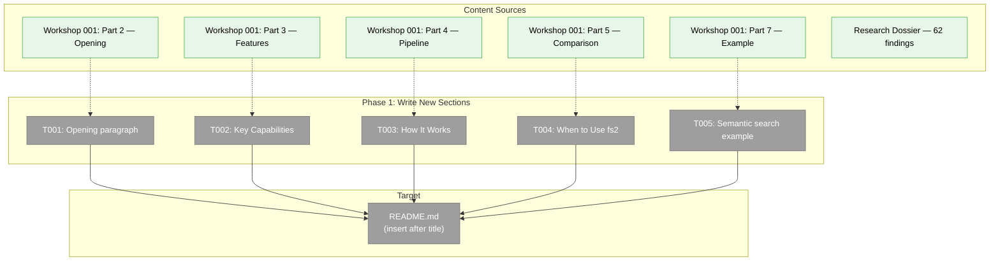
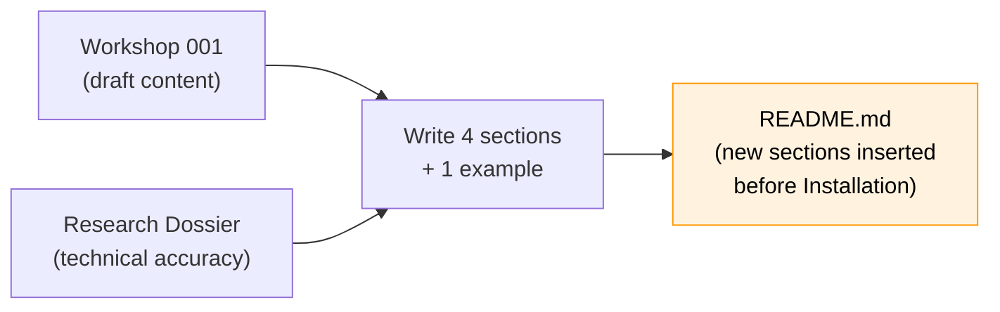
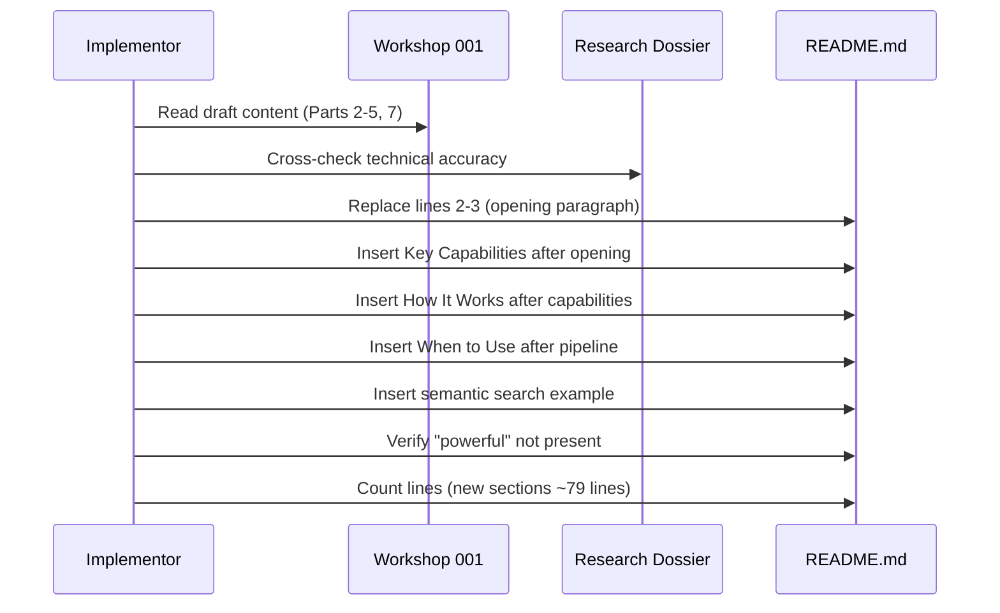

# Tasks Dossier: Phase 1 — Write New Sections

**Plan**: [better-documentation-plan.md](../../better-documentation-plan.md)
**Phase**: Phase 1: Write New Sections
**Workshop**: [001-selling-the-premise.md](../../workshops/001-selling-the-premise.md)
**Generated**: 2026-04-13
**Status**: Ready

---

## Executive Briefing

**Purpose**: Write the four new README sections that establish fs2's value proposition — opening paragraph, Key Capabilities, How It Works, and When to Use — plus a semantic search example. These sections will be inserted into the existing README between the title and the current Installation section.

**What We're Building**: New markdown content for `README.md` (lines 2-3 will be replaced and ~79 lines of new content inserted). No code changes. No guide modifications. The content follows tone and structure decisions from Workshop 001.

**Goals**:
- ✅ Opening paragraph that explains the parse → enrich → search pipeline in 3-5 sentences
- ✅ 5 feature blocks (structural parsing, AI summaries, semantic search, cross-file rels, multi-repo)
- ✅ 6-step pipeline list showing the scan stages
- ✅ Comparison table positioning fs2 alongside grep/ripgrep (complementary, not competitive)
- ✅ Semantic search "aha moment" example where query terms are absent from source code

**Non-Goals**:
- ❌ Restructuring existing sections (that's Phase 2)
- ❌ Trimming MCP/Scanning/Embeddings content (that's Phase 2)
- ❌ Modifying any guide documents
- ❌ Adding any code — this is documentation only

---

## Pre-Implementation Check

| File | Exists? | Domain Check | Notes |
|------|---------|-------------|-------|
| `/Users/jordanknight/substrate/fs2/048-better-documentation/README.md` | ✅ Yes (457 lines, 12700 bytes) | documentation ✅ | Primary target. Lines 1-3 will be modified, new sections inserted after line 3 |

**No harness** — documentation-only change. Implementation will use visual review of rendered markdown.

**No concept duplication check needed** — no new code concepts being introduced.

---

## Architecture Map



---

## Tasks

| Status | ID | Task | Domain | Path(s) | Done When | Notes |
|--------|-----|------|--------|---------|-----------|-------|
| [x] | T001 | Write opening paragraph replacing lines 2-3 | documentation | `/Users/jordanknight/substrate/fs2/048-better-documentation/README.md` | 3-5 sentences; explains parse → enrich → search pipeline; mentions both CLI and MCP audiences; no superlatives | Workshop Part 2, Option A selected. Replace current one-liner with factual pipeline description. Key: sentence 1 = parse/decompose, sentence 2 = enrich (AI summaries + embeddings), sentence 3 = what you get (searchable graph, search modes, MCP). |
| [x] | T002 | Write "Key Capabilities" H2 section | documentation | `/Users/jordanknight/substrate/fs2/048-better-documentation/README.md` | Exactly 5 blocks: structural parsing, AI-generated summaries, semantic search, cross-file relationships, multi-repository. Each 2-3 sentences prose, no inline code, no superlatives. | Workshop Part 3 has draft prose. Each block pattern: **what it is** (technical noun) → **how it works** (1 sentence) → **why you'd care** (concrete example). Finding 06: implement workshop decisions directly. |
| [x] | T003 | Write "How It Works" H2 section | documentation | `/Users/jordanknight/substrate/fs2/048-better-documentation/README.md` | 6-step numbered list (Scan, Parse, Relate, Summarize, Embed, Store). Each step 1 sentence. Closing sentence mentions CLI and MCP queryability. | Workshop Part 4, Option A (numbered list). Not Mermaid — renders everywhere. Actual stage order from `scan_pipeline.py:230-235`: Discovery→Parsing→CrossFileRels→SmartContent→Embedding→Storage. |
| [x] | T004 | Write "When to Use fs2" H2 section | documentation | `/Users/jordanknight/substrate/fs2/048-better-documentation/README.md` | Opens with sentence acknowledging grep/ripgrep. Comparison table ≥ 7 rows. One parenthetical explaining what MCP is. | Workshop Part 5: "different tool, different job" framing. Table maps needs to tools. Resolves AC-11 (MCP explanation). Finding 06. |
| [x] | T005 | Write semantic search example | documentation | `/Users/jordanknight/substrate/fs2/048-better-documentation/README.md` | Shows search query where terms don't appear in source. Results include smart_content. Explanation in 1 sentence. | Workshop Part 7: auth/JWT "aha moment". Place after "When to Use" or within "Key Capabilities" under semantic search. Show `fs2 search "..." --mode semantic` with results that include AI summary arrows. |

**Task ordering**: T001 → T002 → T003 → T004 → T005 is natural document flow (top to bottom), but all tasks are independent — they can be written in any order and assembled. The implementor should write all content in a single pass on `README.md` by inserting after the title line and before `## Installation`.

---

## Context Brief

### Key findings from plan

- **Finding 01**: No external links reference README heading anchors — restructuring is safe
- **Finding 06**: Workshop resolved content decisions (Option A opening, numbered pipeline, respectful comparison table) — implement directly, don't re-deliberate

### Workshop content (authoritative — do not deviate)

**Opening (Part 2, Option A — selected)**:
> fs2 parses your codebase into individual code elements — functions, classes, methods — then enriches each one with AI-generated summaries and vector embeddings. The result is a searchable code graph that supports text, regex, and semantic search across one or many repositories, available as a CLI or through MCP for AI coding agents.

**Key Capabilities (Part 3 — 5 blocks)**:
1. Structural parsing — tree-sitter, 40+ languages, individual nodes with source/signature/qualified name
2. AI-generated summaries — LLM produces 1-2 sentence summaries per node, powers semantic search
3. Semantic search — embeds both raw code and summaries, searches both channels, also text/regex
4. Cross-file relationships — SCIP-based, import/call resolution, Python/TS/JS/Go/C#
5. Multi-repository — named graphs, query across all from one installation, monorepos/shared libs/legacy

**How It Works (Part 4, Option A — numbered list)**:
1. Scan — discover files
2. Parse — tree-sitter decomposition
3. Relate — SCIP cross-file refs
4. Summarize — LLM summaries
5. Embed — vector embeddings for code + summaries
6. Store — graph persistence

**When to Use (Part 5 — comparison table with 7 rows)**:
- Acknowledges grep/ripgrep respectfully
- 7 need/tool rows from workshop draft

**Semantic search example (Part 7 — "aha moment")**:
- Query: "function that validates user authentication tokens"
- Results: `validate_token` and `require_auth` (neither contains "authentication")
- Because fs2 searches AI-generated summaries alongside raw code

### Domain dependencies

None. This phase consumes only the workshop content and research dossier — no code domain dependencies.

### Domain constraints

- `README.md` is the only file modified
- New sections are inserted between title (line 1) and `## Installation` (line 5)
- No code blocks in Key Capabilities section (prose only per Workshop Part 3)
- Code blocks allowed in How It Works (for CLI commands) and the semantic search example

### Harness context

No agent harness configured. Documentation-only change. Agent will use visual review of rendered markdown for validation.

### Tone constraints (from Workshop 001)

- **Voice**: Senior engineer explaining to another engineer over coffee
- **Golden rule**: Remove all adjectives — if it still sounds impressive, it's written correctly
- **Do**: State what it does, then show it. Use precise technical language.
- **Don't**: Superlatives, marketing cadence, defensive comparisons, exclamation marks
- **Banned words**: "powerful", "revolutionary", "cutting-edge", "advanced", "unlock", "supercharge"
- **Test**: Does the word "powerful" appear? → Fail AC-07

### Research references (for implementor context)

| Research ID | What it tells you | Use it for |
|-------------|-------------------|-----------|
| IA-01→IA-10 | Full pipeline implementation details | Accurate pipeline step descriptions in T003 |
| PS-03 | Node decomposition is AST-aware, language-aware, depth-limited | T002 structural parsing block |
| PS-04 | Smart content templates are category-specific (file/type/callable/section/block) | T002 AI summaries block |
| PS-09 | Dual-channel search: raw code + AI summary embeddings | T002 semantic search block |
| DB-06 | Multi-repo: named graphs, one installation | T002 multi-repo block |
| IA-07 | SCIP: Python, TS, JS, Go, C# | T002 cross-file block + T004 comparison |

### Reusable from prior phases

None — this is Phase 1.

---

## Mermaid Flow Diagram



## Mermaid Sequence Diagram



---

## Discoveries & Learnings

_Populated during implementation by plan-6._

| Date | Task | Type | Discovery | Resolution | References |
|------|------|------|-----------|------------|------------|

---

## Directory Layout

```
docs/plans/048-better-documentation/
├── better-documentation-plan.md
├── better-documentation-spec.md
├── better-documentation.fltplan.md
├── research-dossier.md
├── workshops/
│   └── 001-selling-the-premise.md
└── tasks/
    └── phase-1-write-new-sections/
        ├── tasks.md                  ← this file
        ├── tasks.fltplan.md          ← generated below
        └── execution.log.md          # created by plan-6
```
