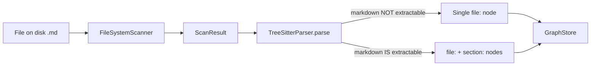

# Research Report: Markdown Section Splitting for FlowSpace

**Generated**: 2026-04-14T22:55:00Z
**Research Query**: "Investigate markdown heading structure to determine optimal split level (#, ##, ###) and research implementation approaches (treesitter vs hand-rolled chunker)"
**Mode**: Plan-Associated
**Plan Folder**: `docs/plans/051-markdown-splitting`
**FlowSpace**: Not Available (no graph.pickle)
**Findings**: 25+ across 6 subagents

---

## Executive Summary

### What We're Adding

Markdown section splitting as a new node type in FlowSpace — analogous to how code files are split by function/method/class via tree-sitter. This enables sub-file search resolution for documentation files.

### Business Purpose

Currently, markdown files in the FlowSpace graph are indexed as single `file:` nodes. In large plan repositories (1,797 files, 580K lines in the analyzed corpus), file-level resolution is too coarse for effective semantic search. Splitting by heading creates meaningful, searchable sections.

### Key Insights

1. **Split at `##` (H2)** — Empirical analysis of 1,797 files shows H2 produces median 18-line chunks (92.1% between 5–200 lines). H3 is too granular; H1 is too coarse.
2. **fs2 already has the model for this** — `CodeNode.create_section()` and category `"section"` exist. The `_extract_name()` method already special-cases `"heading"`. Markdown just isn't in `EXTRACTABLE_LANGUAGES`.
3. **Hand-roll the splitter — tree-sitter is confirmed overkill** — Experimentally verified: tree-sitter produces **14,454 nodes** for an 1,828-line markdown file (7.9 nodes/line). We only need ~70 section nodes. A hand-rolled ~80-line splitter handles this cleanly with zero new dependencies.

### Quick Stats

| Metric | Value |
|--------|-------|
| **Files analyzed** | 1,797 markdown files |
| **Total lines** | 580,193 |
| **Median file size** | 234 lines |
| **H2 sections total** | 15,819 |
| **H2 avg per file** | 8.8 |
| **Median H2 chunk** | 18 lines |
| **H2 chunks in sweet spot (5–200 lines)** | 92.1% |

---

## How It Currently Works

### Entry Points

| Entry Point | Type | Location | Purpose |
|------------|------|----------|---------|
| `fs2 scan` | CLI Command | `src/fs2/cli/` | Triggers full scan pipeline |
| `ScanPipeline.execute()` | Service | `src/fs2/core/services/scan_pipeline.py:224-315` | Orchestrates discovery → parsing → storage |
| `TreeSitterParser.parse()` | Adapter | `src/fs2/core/adapters/ast_parser_impl.py:461-582` | Parses individual files into `CodeNode`s |

### Core Execution Flow

1. **Discovery** — `DiscoveryStage` uses `FileSystemScanner` to find files → `ScanResult(path, size_bytes)`
   - `src/fs2/core/services/stages/discovery_stage.py:20-73`

2. **Language Detection** — `detect_language()` maps `.md`/`.markdown` → `"markdown"`
   - `src/fs2/core/adapters/ast_parser_impl.py:63-245`

3. **Parse Decision** — Parser checks if language is in `EXTRACTABLE_LANGUAGES`
   - Markdown is **NOT** in this set → file-level node only
   - `src/fs2/core/adapters/ast_parser_impl.py:334-337, 546-580`

4. **Node Creation** — File node created with `content_type=CONTENT`
   - `src/fs2/core/models/content_type.py:13-33`

5. **Storage** — Nodes written to NetworkX DiGraph with parent→child edges
   - `src/fs2/core/services/stages/storage_stage.py:62-115`

### Data Flow



### Current Markdown Handling

- `.md`/`.markdown` files detected as language `"markdown"`
- Classified as `ContentType.CONTENT` (800 token chunks for embedding, vs 400 for code)
- Stored as a single `file:{path}` node — no sub-file splitting
- The `_extract_name()` method already has a heading special case (line ~849-856) but it never runs for markdown

---

## Architecture & Design

### Component Map

#### Core Components for Markdown Splitting

| Component | Location | Role |
|-----------|----------|------|
| `TreeSitterParser` | `src/fs2/core/adapters/ast_parser_impl.py` | Orchestrates parsing; holds `EXTRACTABLE_LANGUAGES` |
| `LanguageHandler` (ABC) | `src/fs2/core/adapters/ast_languages/handler.py:28-65` | Per-language config (container types, skip sets) |
| `PythonHandler` | `src/fs2/core/adapters/ast_languages/python.py:27-51` | Exemplar language handler |
| `CodeNode` | `src/fs2/core/models/code_node.py:96-205` | Data model; has `create_section()` factory |
| `classify_node()` | `src/fs2/core/models/code_node.py:27-93` | Maps ts_kind → category; `*heading*` → `"section"` |
| `ContentType` | `src/fs2/core/models/content_type.py:13-33` | `CODE` vs `CONTENT` classification |

### Node ID Format

- File: `file:path/to/doc.md`
- Section: `section:path/to/doc.md:Section Title` (using `create_section()`)

### Existing Extension Points

The architecture is well-designed for adding markdown:
1. Add `"markdown"` to `EXTRACTABLE_LANGUAGES`
2. Create `MarkdownHandler` in `src/fs2/core/adapters/ast_languages/`
3. Use existing `section` category and `create_section()` factory

---

## Critical Finding 1: Split at H2 (`##`)

**Impact**: Critical — determines the fundamental design of the feature
**Sources**: Subagent 1 (Heading Analysis), empirical data from 1,797 files

### Empirical Evidence

**Heading frequency across 1,797 markdown files:**

| Level | Total Count | Avg per File |
|-------|------------|-------------|
| `#` (H1) | 6,310 | 3.51 |
| `##` (H2) | 15,819 | 8.80 |
| `###` (H3) | 24,637 | 13.71 |
| `####` (H4) | 2,809 | 1.56 |

**Chunk size analysis:**

| Split Level | Chunks | Median Lines | Mean Lines | P25 | P75 | % in 5–200 range |
|-------------|--------|-------------|-----------|-----|-----|-------------------|
| H1 (`#`) | ~6,310 | ~92 | ~92 | — | — | ~70% |
| **H2 (`##`)** | **~15,819** | **18** | **~37** | **8** | **33** | **92.1%** |
| H3 (`###`) | ~24,637 | 12 | ~24 | 5 | 25 | ~88% |

**File size distribution (lines):**

| Metric | Value |
|--------|-------|
| Min | 1 |
| P10 | 31 |
| P25 | 82 |
| Median | 234 |
| P75 | 432 |
| P90 | 709 |
| Max | 5,000+ |

### Why H2

- **H1 is too coarse**: Many files use H1 only for the title, so you'd get ~1 chunk per file — barely better than file-level.
- **H2 is the sweet spot**: Produces ~8.8 chunks per file. Median chunk is 18 lines — small enough for precise search, large enough to be semantically meaningful. 92.1% of chunks land in the 5–200 line range.
- **H3 is too granular**: Produces ~13.7 chunks per file. Many H3 sections are tiny leaf items (checklist entries, single-paragraph subsections). Fragments context.

### Typical Document Structure

```markdown
# Plan Title                    ← H1: Title (1 per file)
## Executive Summary            ← H2: Major section  ✅ SPLIT HERE
## Technical Context            ← H2: Major section  ✅ SPLIT HERE
### Current System State        ← H3: Subsection (included in parent H2 chunk)
### Integration Requirements    ← H3: Subsection (included in parent H2 chunk)
## Implementation Phases        ← H2: Major section  ✅ SPLIT HERE
### Phase 1: Core               ← H3: Subsection
#### Task 1.1                   ← H4: Detail
## Testing Philosophy           ← H2: Major section  ✅ SPLIT HERE
```

### Recommendation

**Split at `##` by default.** Each H2 section becomes a `section:` node, with all content up to the next H2 (including H3/H4 subsections) included in that section's content.

Consider making this configurable later (a `heading_depth` parameter), but H2 is the right default.

---

## Critical Finding 2: fs2 Architecture Already Supports This

**Impact**: Critical — dramatically reduces implementation effort
**Sources**: Subagents 2, 4 (Parser and Current Handling analysis)

### What Already Exists

| Feature | Status | Location |
|---------|--------|----------|
| `"section"` category | ✅ Exists | `classify_node()` in `code_node.py:27-93` |
| `CodeNode.create_section()` | ✅ Exists | `code_node.py:471-554` |
| `ContentType.CONTENT` | ✅ Exists | `content_type.py:13-33` |
| Heading name extraction | ✅ Exists | `_extract_name()` special-case at `ast_parser_impl.py:849-856` |
| Language detection for `.md` | ✅ Exists | `ast_parser_impl.py:89-91` |
| Language handler pattern | ✅ Exists | `ast_languages/handler.py`, `python.py` as exemplar |
| Node ID `section:{path}:{name}` | ✅ Exists | `code_node.py:107-109` |

### What Needs Adding

| Feature | Work Required |
|---------|---------------|
| Add `"markdown"` to `EXTRACTABLE_LANGUAGES` | 1 line change |
| Create `MarkdownHandler` | New file ~50 lines |
| Markdown-specific node extraction logic | OR hand-rolled splitter (see Finding 3) |

---

## Critical Finding 3: Hand-Roll the Splitter (Tree-sitter Is Overkill)

**Impact**: Critical — core implementation decision
**Sources**: Subagents 3, 5 (Treesitter Research, Web Research) + direct experimentation
**Decision**: ✅ **Hand-rolled splitter** — tree-sitter confirmed as overkill via experiment

### Experiment: Tree-sitter Markdown in Practice

We confirmed that `tree-sitter-language-pack` **does include markdown** and ran it against real plan files.

**Test file**: `wf-basics-plan.md` (1,828 lines)

| Metric | Value | Assessment |
|--------|-------|-----------|
| **Total tree-sitter nodes** | **14,454** | 🔴 Massive |
| **Nodes per line** | **7.9** | 🔴 ~4x worse than code files |
| **Section/heading nodes** | **~70** | ✅ These are what we need |
| **Noise nodes** | **14,384** | 🔴 Every `\|`, `-`, `*`, `:` gets its own node |

Tree-sitter parses every table delimiter dash, every inline formatting character, every pipe — individually. This is what the AST looks like for a simple 2-column table row:

```
pipe_table_row [15:0-15:22]
  | [15:0-15:1]  "|"
  pipe_table_cell [15:2-15:6]  "CLI "
  | [15:6-15:7]  "|"
  pipe_table_cell [15:8-15:21]
    . [15:17-15:18]  "."
  | [15:21-15:22]  "|"
```

The **section/heading structure IS correct** — nested `section` nodes with `atx_heading` children, properly handling fenced code blocks. But you'd be parsing 14K nodes just to extract ~70 sections.

**Comparison with the existing anonymous node problem (PL-01)**: The JS/TS parser created 13,649 anonymous nodes that polluted the graph. A single markdown plan file creates 14,454 nodes — **worse than the entire JS/TS anonymous node problem, per file**.

### Why Not Tree-sitter

1. **Node explosion**: 7.9 nodes/line vs ~1-2 for code. Tables and inline formatting are catastrophic.
2. **Existing `_extract_nodes()` would need aggressive filtering** — the anonymous node skip set from PL-01 would need massive expansion for markdown-specific node types.
3. **We only need ~70 nodes from 14,454** — a 99.5% waste ratio.
4. **Additional caveats**: maintainer says "not recommended where correctness is important"; setext headings are NOT wrapped in section nodes.

### Why Hand-Rolled

| Aspect | Assessment |
|--------|-----------|
| **Complexity** | ~50-80 lines of Python |
| **Dependencies** | None (stdlib `re`) |
| **Performance** | Very fast — simple line-by-line scan |
| **Maintenance** | Self-contained, easy to understand and test |
| **Integration** | Returns `CodeNode` list directly, bypasses tree-sitter pipeline |
| **Edge case: code blocks** | Track fenced code block state (``` toggle) ⚠️ manageable |
| **Edge case: inline formatting** | Not relevant — we only match line-start `## ` |

**The only edge case worth handling** is fenced code blocks — skip `## ` patterns inside `` ``` `` blocks. This is a simple boolean toggle on a line-by-line scan.

### Implementation Design

```python
# src/fs2/core/adapters/markdown_splitter.py

class MarkdownSectionSplitter:
    """Split markdown files into sections at H2 heading boundaries."""

    def split(self, file_path: str, content: str) -> list[CodeNode]:
        lines = content.split('\n')
        sections = []
        current_heading = None
        current_start = 0
        in_code_block = False

        for i, line in enumerate(lines):
            # Track fenced code blocks
            if line.strip().startswith('```'):
                in_code_block = not in_code_block
                continue

            if in_code_block:
                continue

            # Match H2 headings (## but not ###)
            if line.startswith('## ') and not line.startswith('### '):
                if current_heading is not None:
                    sections.append(self._make_section(
                        file_path, current_heading, current_start, i - 1, lines
                    ))
                current_heading = line[3:].strip()
                current_start = i

        # Final section
        if current_heading is not None:
            sections.append(self._make_section(
                file_path, current_heading, current_start, len(lines) - 1, lines
            ))

        return sections
```

### Splitter Requirements

1. Split at `##` (H2) by default
2. Include H3/H4 content within the parent H2 section
3. Handle preamble (content before first H2) as a special section
4. Skip headings inside fenced code blocks (``` toggle)
5. Make heading depth configurable for future use

---

## Prior Learnings (From Previous Implementations)

### 📚 PL-01: Tree-sitter Anonymous Node Problem
**Source**: `docs/plans/030-better-node-parsing/better-node-parsing-spec.md:9-15, 28-33, 75-77`
**Type**: gotcha

**What They Found**: Tree-sitter creates 13,649 anonymous `@line.column` nodes that pollute the graph. The fix is a `skip_when_anonymous` set of 10 tree-sitter kinds.

**Why This Matters Now**: Markdown tree-sitter nodes may include many anonymous nodes (paragraph content, inline elements). The markdown handler/splitter must be selective about what nodes it creates — only `section` nodes for H2 headings, not every paragraph.

### 📚 PL-02: Named Arrow Function Gotcha
**Source**: `docs/plans/030-better-node-parsing/tasks/phase-1-skip-anonymous-nodes/execution.log.md:63-69`
**Type**: gotcha

**What They Found**: Node naming can be unintuitive — the identifier sometimes lives on a parent node, not the node itself.

**Why This Matters Now**: Markdown heading text lives inside `atx_heading → inline` children. Must extract correctly.

### 📚 PL-03: Chunking Token Limits
**Source**: `docs/plans/030-better-node-parsing/workshop.md:633-653`
**Type**: decision

**What They Found**: fs2 uses 400 tokens for code, 800 for docs for embedding chunks. Semantic search matches at the chunk level.

**Why This Matters Now**: H2 sections (median 18 lines, ~90 tokens) fit well within the 800-token doc limit. Multiple H2 sections could even be combined into a single embedding chunk. This validates H2 as the right granularity.

### 📚 PL-04: No Domain Registry
**Source**: `docs/plans/030-better-node-parsing/better-node-parsing-spec.md:48-58`
**Type**: decision

**What They Found**: No formal domain registry; relevant domains inferred as: AST Parsing, CodeNode Model, Language Support, Scan Pipeline, Graph Storage.

**Why This Matters Now**: This feature touches AST Parsing and Language Support domains primarily. No formal domain boundary to worry about.

### 📚 PL-05: Markdown Detection Already Works
**Source**: `077-random-enhancements-2/docs/plans/069-tree-metafiles/research-dossier.md:176-184`
**Type**: insight

**What They Found**: `.md` metafiles are detected as normal markdown. `detectLanguage()` handles them correctly.

**Why This Matters Now**: Confirms that the language detection layer needs no changes — markdown files are already correctly identified.

---

## Modification Considerations

### ✅ Safe to Modify

1. **`EXTRACTABLE_LANGUAGES`** — Adding `"markdown"` is a safe, additive change
2. **`ast_languages/` directory** — Adding a new `MarkdownHandler` follows the existing pattern (exemplar: `PythonHandler`)
3. **`CodeNode.create_section()`** — Already exists, well-tested

### ⚠️ Modify with Caution

1. **`_extract_nodes()`** — Core extraction loop. Markdown sections behave differently from code (flat heading list vs nested class/method hierarchy). May need a separate code path.
2. **Embedding pipeline** — H2 sections may change embedding chunk composition. Verify chunk sizes stay reasonable.

### 🚫 Danger Zones

1. **`classify_node()`** — Changing category classification could affect all languages. Markdown handling should be isolated.
2. **Node ID generation** — Must ensure section node IDs are unique when multiple H2s share similar names (e.g., "## Overview" appears in many files).

---

## Implementation Sketch

### Hand-Rolled Splitter

```python
# src/fs2/core/adapters/ast_languages/markdown.py

class MarkdownSectionSplitter:
    """Split markdown files into sections at H2 heading boundaries."""

    def split(self, file_path: str, content: str) -> list[CodeNode]:
        lines = content.split('\n')
        sections = []
        current_heading = None
        current_start = 0
        in_code_block = False

        for i, line in enumerate(lines):
            # Track fenced code blocks
            if line.strip().startswith('```'):
                in_code_block = not in_code_block
                continue

            if in_code_block:
                continue

            # Match H2 headings
            if line.startswith('## ') and not line.startswith('### '):
                if current_heading is not None:
                    sections.append(self._make_section(
                        file_path, current_heading, current_start, i - 1, lines
                    ))
                current_heading = line[3:].strip()
                current_start = i

        # Final section
        if current_heading is not None:
            sections.append(self._make_section(
                file_path, current_heading, current_start, len(lines) - 1, lines
            ))

        return sections
```

### Integration Path

```python
# In ast_parser_impl.py

# 1. Add to EXTRACTABLE_LANGUAGES (or a separate SPLITTABLE_CONTENT set)
MARKDOWN_LANGUAGES = {"markdown"}

# 2. In parse(), after file node creation:
if language in MARKDOWN_LANGUAGES:
    splitter = MarkdownSectionSplitter()
    section_nodes = splitter.split(file_path, content)
    nodes.extend(section_nodes)
    for section in section_nodes:
        section.parent_node_id = file_node.node_id
```

---

## Recommendations

### If Implementing This Feature

1. **Split at H2 (`##`)** — the data strongly supports it as the default (92.1% of chunks in the 5–200 line sweet spot)
2. **Hand-roll the splitter** — experimentally confirmed: tree-sitter produces 14,454 nodes for a single plan file (7.9/line), 99.5% of which are noise. A ~80 line Python splitter is simpler, faster, zero new dependencies
3. **Handle fenced code blocks** — skip `## ` patterns inside `` ``` `` blocks (boolean toggle on line scan)
4. **Handle the preamble** — content before the first H2 should be captured as a special section
5. **Make heading depth configurable** — default to 2, allow override via config for future use

### Testing Strategy

1. Test with real plan files from `~/substrate/077-random-enhancements-2/docs/plans/`
2. Verify section node IDs are unique per file
3. Verify embedding chunks stay within 800-token limit
4. Verify search finds sections with relevant queries

### Suggested Phases

| Phase | Description |
|-------|-------------|
| 1 | Implement hand-rolled `MarkdownSectionSplitter` (~80 lines) |
| 2 | Integrate into parse pipeline (custom path for markdown, not `EXTRACTABLE_LANGUAGES`) |
| 3 | Add tests with real markdown fixtures from plan repos |
| 4 | Verify search and embedding behavior with section nodes |

---

## Next Steps

- **To proceed to specification**: Run `/plan-1b-specify "Add markdown section splitting to FlowSpace"`
- **To ask follow-up questions**: The research is complete — ask anything

---

**Research Complete**: 2026-04-14T23:02:00Z
**Report Location**: `docs/plans/051-markdown-splitting/research-dossier.md`
**Key Decision**: Hand-rolled splitter at H2, confirmed via tree-sitter experiment
